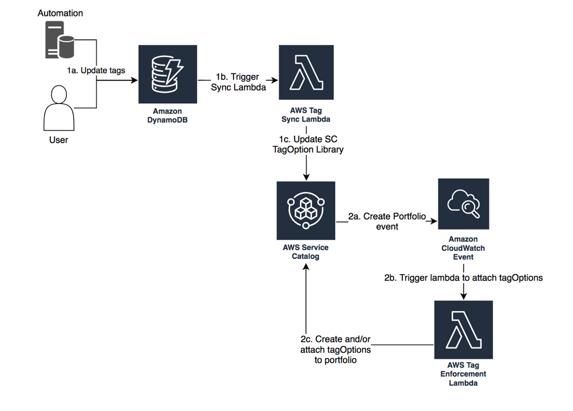

## AWS Tag Enforcement Service Catalog

Tag enforcement using AWS Service Catalog, Amazon DynamoDB, Cloudwatch Events, and AWS Lambda

## License Summary

This sample code is made available under a modified MIT license. See the LICENSE file.

# **Enforce tags on your AWS resources automatically from a central database**  **using AWS Service Catalog, Amazon DynamoDB, Cloudwatch Events, and AWS Lambda**

Some of the customers I work with have a central database where they keep their tag values and would like to enforce tags on Service Catalog products by leveraging their database. e.g. some customers have a central location where they keep all of their cost center information and they regularly update it as new business units come online or get removed. One of the common databases I have seen customers leverage is DynamoDB. In this blog post, I will show you how to retrieve and enforce your tags automatically via AWS Service Catalog, Lambda and DynamoDB.

However, before we dive further, lets revise a few concepts that will serve as pre-requisite refreshers for understanding the tag enforcement solution.

[AWS Service Catalog ](https://docs.aws.amazon.com/servicecatalog/latest/adminguide/introduction.html)enables organizations to create and manage catalogs of IT services that are approved for use on AWS. The following are key concepts relating to AWS Service Catalog:

- A [**product**](http://docs.aws.amazon.com/servicecatalog/latest/adminguide/what-is_concepts.html#what-is_concepts-product) is a blueprint for building your AWS resources that you want to make available for deployment on AWS along with the configuration information. You create a product by importing a [CloudFormation template](https://docs.aws.amazon.com/AWSCloudFormation/latest/UserGuide/cfn-whatis-concepts.html), or, in case of AWS Marketplace-based products, by copying the product to the AWS Service Catalog. A product can belong to multiple portfolios. To know more about the product, see the AWS Service Catalog [documentation](https://docs.aws.amazon.com/servicecatalog/latest/adminguide/what-is_concepts.html#what-is_concepts-product).
- A [**portfolio**](http://docs.aws.amazon.com/servicecatalog/latest/adminguide/what-is_concepts.html#what-is_concepts-portfolio) is a collection of  **products** , together with the configuration information. You can use portfolios to manage the user access to specific products. You can grant portfolio access at an IAM user, IAM group, and IAM role level. To know more about the portfolio, see the AWS Service Catalog [documentation](https://docs.aws.amazon.com/servicecatalog/latest/adminguide/what-is_concepts.html#what-is_concepts-portfolio).
- A [**provisioned product**](http://docs.aws.amazon.com/servicecatalog/latest/adminguide/what-is_concepts.html#what-is_concepts-provprod) is a [CloudFormation stack](http://docs.aws.amazon.com/AWSCloudFormation/latest/UserGuide/stacks.html) that is, the AWS resources that are created. When an [end user](http://docs.aws.amazon.com/servicecatalog/latest/adminguide/what-is_concepts.html#what-is_concepts-users) launches a product, the AWS Service Catalog provisions the product in form of a CloudFormation stack. To know more about the provisioned product, see the AWS Service Catalog [documentation](https://docs.aws.amazon.com/servicecatalog/latest/adminguide/what-is_concepts.html#what-is_concepts-provprod).
- [**Constraints**](http://docs.aws.amazon.com/servicecatalog/latest/adminguide/what-is_concepts.html#what-is_concepts-constraints) control the way users can deploy a product. With  **launch constraints** , you can specify a role that the AWS Service Catalog can assume to launch a product from the portfolio. To know more about constraints, see the AWS Service Catalog [documentation](https://docs.aws.amazon.com/servicecatalog/latest/adminguide/what-is_concepts.html#what-is_concepts-constraints).
- A [**TagOption**](https://docs.aws.amazon.com/servicecatalog/latest/adminguide/tagoptions.html) is a key-value pair managed in AWS Service Catalog. It is not an AWS tag, but serves as a template for creating an AWS tag based on the TagOption. These tagOptions are applied to provisioned products as AWS tags.

[AWS Cloudwatch Events](https://docs.aws.amazon.com/AmazonCloudWatch/latest/events/WhatIsCloudWatchEvents.html) deliver a near real-time stream of system events that describe changes in AWS resources. Using simple rules that you can set up in a couple of minutes, you can easily route each type of event to one or more targets

[AWS Lambda](https://docs.aws.amazon.com/lambda/latest/dg/welcome.html) is a compute service that lets you run code without provisioning or managing servers.

[Amazon DynamoDB ](https://docs.aws.amazon.com/amazondynamodb/latest/developerguide/Introduction.html) is a fully managed NoSQL database service that provides fast and predictable performance with seamless scalability.

**Solution Overview**

This sample solution will help you set up tag enforcement in your AWS environment, and perform the following functions:

1. **Sync newly added tags in the DynamoDB table**
  When you add a new tag pair in DynamoDB, it will trigger the **TagSync** Lambda function and create the same tag pair in your TagOption library
  Additionally, the TagOption created in the previous step will be associated with all your existing portfolios
2. **Sync removal of tags from the DynamoDB table**
  When you remove a tag pair from DynamoDB, it will trigger the **TagSync** Lambda function, disassociate the corresponding TagOption from all the associated portfolios, and remove it from your TagOption library
3. **Sync updated tags in the DynamoDB table**
  When you update a tag pair in DynamoDB, it will trigger the **TagSync** Lambda function, update the corresponding TagOption your TagOption library, and all the associated portfolios
4. **Apply all the TagOptions to new portfolios automatically**
  When you create a new AWS Service Catalog portfolio, a Cloudwatch event will trigger the **TagEnforcement** Lambda function, and associate all the TagOptions from your TagOption library to the newly created portfolio

This mechanism ensures that any tags added in AWS DynamoDB are added to your AWS Service Catalog TagOption library, and attached to existing portfolios. Additionally, any newly created portfolios will automatically contain all the TagOptions in your TagOption Library.

Here is an architecture diagram of the tag enforcement process:

**Setup**

Please click the button below to setup this solution in your environment:

	
**Notes**

Please note the following considerations while using this sample solution:

- This solution will not import existing TagOptions from AWS Service Catalog to AWS DynamoDB
- This solution assumes that all the TagOptions in your TagOption library will be created in AWS DynamoDB, and does not consider cases where TagOptions are manually created in AWS Service Catalog.
- This solution will not interfere with manually created TagOptions, unless the same TagOptions are created in the DynamoDB table

Customers may want to extend this solution to support portfolio specific tags, which can be done by adding a portfolio id column in DynamoDB, and updating the logic in the TagSync and TagEnforcement lambda functions.

If you have an idea on how this solution could be extended, we would love to hear your ideas at [aws-sa-servicecatalog@amazon.com](mailto:aws-sa-servicecatalog@amazon.com).

### **Conclusion**

In this post, I have provided a sample solution for ensuring that AWS Service Catalog portfolios created in your environment are tagged automatically using tags from an AWS DynamoDB table. We deployed the solution architecture using a predefined Cloudformation template, ran through a test scenario to ensure the DynamoDB tags were automatically synced with your AWS Service Catalog TagOptions library and portfolios.

Additionally, we went through the possible extensions that you could apply to this solution for your unique compliance use cases. This exercise aims to provide you a head start to your tag compliance strategy, and ensure that all the AWS Service Catalog products launched by your end users will be tagged with a standard set of values defined by your organization.

If you have questions about implementing the solution described in this post, please contact [AWS Support](https://console.aws.amazon.com/support/home).
